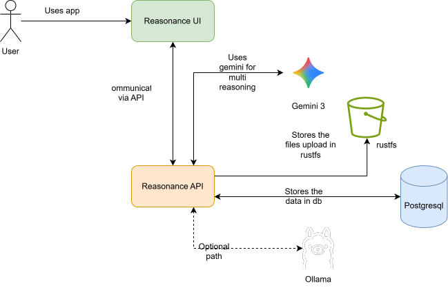

# Reasonance

## Multi-Turn Reasoning That Evolves, Not Responds

**Reasonance is not a chatbot.**

It is a **turn-based reasoning engine** where Gemini maintains and evolves a persistent hypothesis graph across multiple investigative turns, with explicit memory, cross-references, and final synthesis.

Instead of asking Gemini a question and getting an answer, Reasonance creates an environment where:

> Gemini **thinks over time**.

## The Problem

Most LLM applications are single-turn or short-context interactions:

* Prompt → Response → Done
* Chat history as memory
* No visible reasoning state
* No evolution of thought

But real reasoning — the kind used in research, investigations, philosophy, and science — happens across **multiple iterative passes**, where hypotheses are:

* formed
* tested against evidence
* mutated
* cross-referenced
* synthesized

## What Reasonance Does

Reasonance turns Gemini into a **persistent abductive reasoning partner**.

You don’t chat with it.
You **conduct an investigation with it**.

Each investigation proceeds across multiple **turns**:

1. Upload ambiguous material (case file, paradox, document, theory, etc.)
2. Gemini generates initial key insights + signals
3. You choose which insight to pursue and which signal to test
4. Gemini performs a deep abductive dive and mutates the reasoning graph
5. New insights and c are generated with references to prior turns
6. Repeat for multiple turns
7. Gemini performs a final synthesis across the entire reasoning lineage

At the end, you get a **complete investigation archive** showing how thought evolved.

## The Board Is Gemini’s Working Memory

The UI is not a layout.
It is a visualization of Gemini’s cognitive state.

* Left panel → All insights across turns
* Center → Active insight under investigation
* Bottom → signal pool for reasoning
* Top → Turn navigation through reasoning history

You are literally looking at the **AI’s evolving hypothesis graph**.

## The Reasoning Lifecycle

```
Source Material
      ↓
Turn 1: Initial insights + signals
      ↓
Human selects direction
      ↓
Gemini deep dive (What-If hypothesis)
      ↓
Graph mutation (new insights + signal + references)
      ↓
Next Turn built from entire history
      ↓
Final synthesis over full reasoning lineage
```

This is **not chat**.
This is **orchestrated reasoning**.

## Example Use Cases

* Analyzing paradoxes in physics or mathematics
* Investigating case documents or witness statements
* Exploring philosophical or religious texts across perspectives
* Generating scientific insights from ambiguous data
* Research and academic analysis

## Architecture:



This is a **reasoning state machine**, not an API wrapper.

## 🛠️ Tech Stack

* **Backend**: Spring Boot, PostgreSQL
* **Frontend**: Angular
* **LLM**: Gemini 3 / Gemma3n via Ollama
* **Graph Model**: Nodes (insights/signal) + edges (relationships)

Full developer documentation is in `/docs`.

## 🎥 Demo

👉 *[Your 3-minute demo video link]*

## 📚 Usage

[Guide](./docs/USAGE.md)
